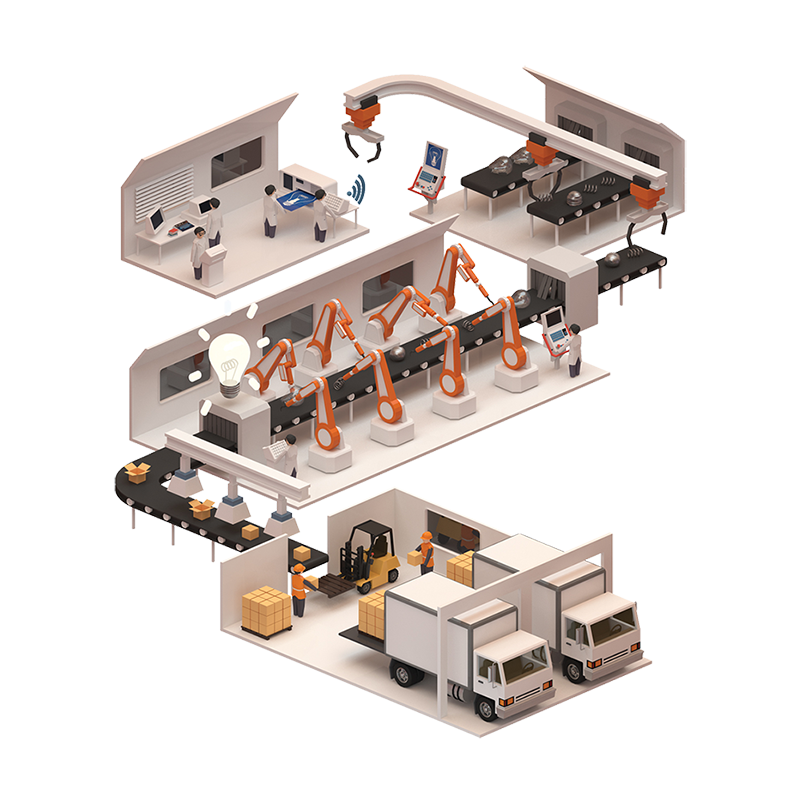
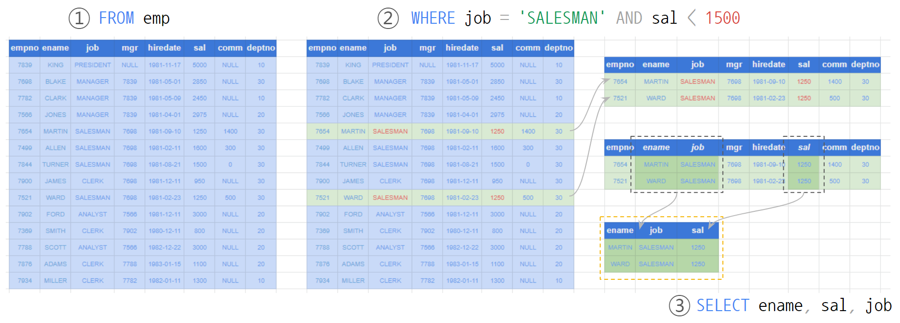

# Simple SELECT Query

```sql
SELECT station_id, name
  FROM `bigquery-public-data.new_york_citibike.citibike_stations`
 WHERE capacity > 10;
```

`SELECT`문(statement)은 테이블을 조회하는 데 사용됩니다.

`Hello, World` 에서 살펴보았던 `SELECT` 문장은 테이블 형태의 결과를 화면에 보여주고 여러분은 그 내용을 보게 됩니다. _테이블을 조회_ 하기 위해서는 그 대상을 만드는 과정이 선행되어야 하는데 `SELECT`문장이 그 역할을 하고 있습니다.

이미 어딘가에 만들어져 저장된 테이블을 조회하는 경우에도 저장된 내용물로부터 조회를 위한 결과물을 생성하는 과정은 필요합니다.  
(`CREATE TABLE`은 테이블을 생성하기 보다는 테이블이 들어갈 공간을 마련하고 `SELECT`나 `INSERT`문이 생성한 결과물을 _저장_하는 역할을 합니다.)

테이블을 생성하기 위한 `SELECT`문은 여러 절(clause)로 이루어지는데 기본 구성요소는 `SELECT`, `FROM`, `WHERE` 절입니다.

<figure><figcaption><p>Conveyor Belt [그림출처 - <a href="https://www.pngwing.com/en/free-png-xvssn">https://www.pngwing.com/en/free-png-xvssn</a>]</p></figcaption></figure>

여기서 잠깐 공장 생산라인에서 원재료가 제품으로 만들어지는 과정을 한 번 상상해 보겠습니다.

자재창고에는 원자재가 보관되어 있고 조립라인에서 필요로 하는 자재들을 컨베이어 벨트에 실어 나르면 각 조립라인에서는 작업 지시서에 의해서 제품을 가공하고 완성된 제품을 새로운 창고에 적재하게 됩니다.

비유하자면 `SELECT`절 혹은 `SELECT list`절은 작업지시서에 의해서 제품을 만들어 내는 생산라인의 **작업대**로 볼 수 있고, `FROM`절은 공장의 **자재창고**와 같은 역할을 하며  `WHERE`절은 생산라인에서 필요로 하는 자재만을 나르도록 검수를 하는 곳이라 할 수 있겠습니다.

공장의 생산라인 비유에서 자재의 흐름을 따라가 보면 **창고**에서 **검수**를 거쳐 **작업**대로 이어지는데 `SELECT`문장을 해석할 때도 이 순서를 따릅니다.

앞선 예시 쿼리를 해석해 보면,

`FROM` 절의 `bigquery-public-data.new_york_citibike.citibike_stations` 라는 창고에서 자재를 하나씩 불출해서 `WHERE` 절의 검수 조건 `capacity > 10` 을 만족하는 자재만 `SELECT` 절로 넘겨 주고,  `SELECT` 절에서는 작업 지시서에 의해 `station_id` 와 `name` 이라는 부분만 추출하여 완제품 창고에 저장하게 만듭니다.

또 다른 예시를 하나 살펴보겠습니다.   결과 테이블이 만들어 지는 순서와 쿼리를 읽어 나가는 순서는 동일합니다.  여기서도 `FROM` 절에 기술된 `emp` 자재창고에서 `WHERE` 절에 기술된 조건을 만족하는 자재(row) 만을 `SELECT` 절에 넘겨  `ename`, `sal`, `job` 을 추출하도록 문장이 작성되어 있습니다.

<figure><figcaption></figcaption></figure>
